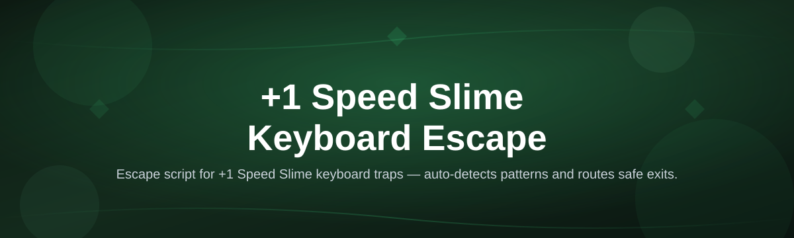
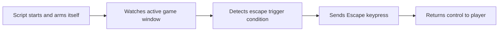

# speed-slime-keyboard-escape-script

*A small Windows companion for players who keep missing the timing window on the Speed Slime escape action.*

## What this is

The **+1 Speed Slime Keyboard Escape Script** is a standalone Windows tool built around one specific mechanic: the moment in Speed Slime-style browser and idle games where pressing Escape at the right instant grants a +1 speed buff before the window closes. Missing that window by even a fraction of a second means losing the buff for the round, and doing it manually run after run gets tiring fast.

Instead of trying to time the keypress yourself every single time, this script watches for the trigger condition and fires the Escape input the moment it's needed, then hands control straight back to you. It's a background helper, not a full automation suite — you still play the game, you just stop worrying about the one twitchy input that decides whether you keep your speed bonus.

  

This button opens the project's landing page, where the current build is available to download.

## Who it is for

- Players grinding Speed Slime-style idle or browser games who keep the +1 buff cycle running for long sessions
- Speedrunners who need consistent, repeatable escape timing instead of relying on reflexes alone
- Streamers who want to keep talking to chat without babysitting a single keypress
- Anyone with slower reaction time or motor difficulty who finds split-second key windows hard to hit manually
- Players testing multiple slime-speed setups who want the timing variable removed from their comparisons

## What you can do

- **Auto-trigger the Escape input** the instant the speed window opens, no manual reflex needed
- **Run quietly in the background** while your game window stays focused and unobstructed
- **Adjust the trigger delay** in small increments to match your specific game version or ping
- **Pause and resume instantly** with a single hotkey so you're never locked out of manual control
- **See a lightweight status indicator** confirming the script is armed and watching
- **Log trigger timestamps** so you can review how consistent your buff windows actually were
- **Run without installing anything** — it's a single executable, nothing gets written to your registry
- **Close it completely** with one click, leaving no background processes behind

## Getting started

1. Open the [landing page](https://Griffinirfury.github.io/speed-slime-keyboard-escape-script/) and download the current build.
2. Extract the file to any folder — no installer, no setup wizard.
3. Run the executable and let it sit in your system tray.
4. Launch your game, get into a Speed Slime round, and let the script watch for the trigger.
5. Use the pause hotkey any time you want to take the keypress back yourself.

## Requirements

| OS | RAM | Disk |
|---|---|---|
| Windows 10 (64-bit) | 2 GB free | 50 MB |
| Windows 11 (64-bit) | 4 GB free | 50 MB |

No .NET installs, no Python runtime, no build toolchain — it's a self-contained executable that runs as-is.

## How it works

The script sits idle until it detects the specific in-game state associated with the Speed Slime escape window, then fires the Escape key press and steps back out of the way.

The delay between detection and keypress is configurable, since different game versions and machines render the trigger a few milliseconds apart. Most players find the default timing works out of the box, then fine-tune from there once they've run a few rounds.

## FAQ

**What exactly does the +1 Speed Slime Keyboard Escape Script do?**
It watches for the moment your Speed Slime buff window opens and presses Escape for you, so you keep the +1 speed bonus without needing perfect manual timing.

**Will this work with any Speed Slime game variant?**
It's built around the standard Escape-to-confirm timing pattern found in most Speed Slime-style games. Some heavily modified or custom builds may use a different trigger condition, in which case the default timing won't line up.

**Does it need administrator permissions to run?**
No. It reads window focus state and sends a single keypress, both of which work fine under a standard user account.

**Why does the buff sometimes still get missed?**
Usually it's a timing mismatch — try adjusting the trigger delay in small steps until the log timestamps land consistently inside your game's actual window.

**Can I run it alongside other overlays or recording software?**
Yes, it doesn't hook into the game process itself, so OBS, Discord overlays, and similar tools run alongside it without conflict.

## Troubleshooting

**The script doesn't seem to trigger at all.**
Confirm your game window is focused when the trigger should fire — the script only watches the active window, not background ones.

**Windows shows a SmartScreen warning on first launch.**
This is expected for a small independent executable without a purchased code-signing certificate. Click "More info" then "Run anyway" if you trust the download source.

**The buff fires but feels early or late.**
Open the settings and nudge the trigger delay up or down in 10ms steps, then check the log timestamps to confirm you've landed inside the window.

**The tray icon disappears after a while.**
This usually means the game closed or lost focus long enough that the script auto-paused. Bring the game window back to front and it should re-arm on its own.

## License

Released under the [MIT License](LICENSE). It's provided as-is, with no warranty — use it at your own discretion and always check the rules of whatever game you're playing it alongside.

  <a href="https://Griffinirfury.github.io/speed-slime-keyboard-escape-script/">
    <img src="https://img.shields.io/badge/DOWNLOAD-Latest_Release-0D9488?style=for-the-badge&logo=windows&logoColor=white&labelColor=0F766E" width="550" alt="